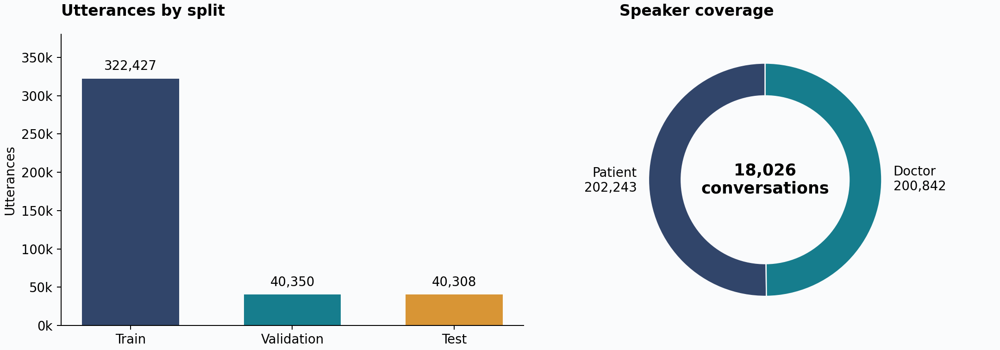
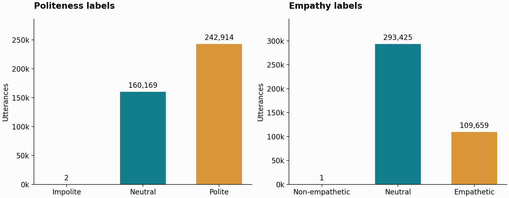
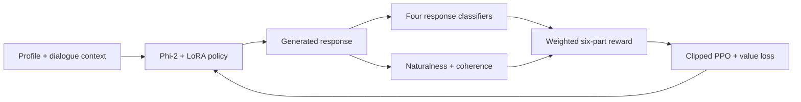
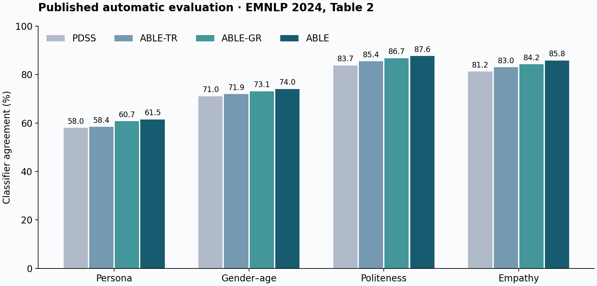

# ABLE · Personalized Disability Support

**[ABLE: Personalized Disability Support with Politeness and Empathy Integration](https://aclanthology.org/2024.emnlp-main.1252/)**

**Kshitij Mishra · Manisha Burja · Asif Ekbal**

EMNLP 2024 · pages 22445–22470

[Paper](https://aclanthology.org/2024.emnlp-main.1252.pdf) · [Dataset](datasets/README.md) · [Results](docs/paper-results.md) · [Implementation](docs/implementation.md) · [BibTeX](CITATION.bib)

ABLE studies personalized conversations about physical disability support. It
conditions responses on a user's gender, age, and OCEAN personality profile,
then combines politeness, empathy, persona, and dialogue-quality rewards during
reinforcement learning.

This repository contains PERPDSCD, a Python package for Phi-2/LoRA supervised
fine-tuning, four RoBERTa reward classifiers, six reward functions, token-level
PPO with a value head, checkpointed generation, and automatic evaluation.

## Quick start

Use Python 3.11 or later. Dataset access and verification use only the Python
standard library.

```bash
git clone https://github.com/Mishrakshitij/ABLE.git
cd ABLE
python3.11 -m venv .venv
source .venv/bin/activate
python -m pip install -e .

python -m able verify-data
python -m able sample --split train --limit 1
```

`python -m able --help` lists all commands. Run commands from the repository
root; paths in the JSON configurations are relative to the working directory.

## Dataset

**PERPDSCD** contains **403,085 utterances** in **18,026 conversations** between
Patient and Doctor speakers, covering **13 support topics** and **19 OCEAN
persona classes**. The data includes two gender categories, three age groups,
and three-class politeness and empathy labels.

The five CSV shards are in [`datasets/perpdscd/`](datasets/perpdscd/).
Each file is smaller than 40 MiB and works with ordinary Git.
The [dataset guide](datasets/README.md) describes every column, label mapping,
and file. [`manifest.json`](datasets/perpdscd/manifest.json) contains checksums
and class counts; [`splits.json`](datasets/perpdscd/splits.json) lists the
conversation IDs.

| Split | Conversations | Utterances | Doctor responses |
| --- | ---: | ---: | ---: |
| Train | 14,420 | 322,427 | 160,666 |
| Validation | 1,803 | 40,350 | 20,103 |
| Test | 1,803 | 40,308 | 20,073 |
| **Total** | **18,026** | **403,085** | **200,842** |

Conversations remain within one split. Identical complete dialogues stay
together. Model inputs contain the profile and earlier turns; Doctor utterances
provide the response targets.



| Task | Label IDs |
| --- | --- |
| Persona | `0`–`18`, following Appendix A.1.2 |
| Gender–age | `0`–`5`: male younger/middle/older, then female younger/middle/older |
| Politeness | `0` impolite · `1` neutral · `2` polite |
| Empathy | `0` non-empathetic · `1` neutral · `2` empathetic |

Label counts across both speakers:

| Politeness | Utterances | Empathy | Utterances |
| --- | ---: | --- | ---: |
| Impolite | 2 | Non-empathetic | 1 |
| Neutral | 160,169 | Neutral | 293,425 |
| Polite | 242,914 | Empathetic | 109,659 |



Read a training example without pandas:

```python
from able.data import iter_examples

example = next(iter_examples("datasets", "train"))
print(example.prompt)
print(example.response)
print(example.politeness_label, example.empathy_label)
```

To read raw rows, use `able.data.iter_rows("datasets", "train")`. Address
utterances by `row_id`, or by `Convo_id` with `turn_index`.

## Train ABLE

Install the training and evaluation dependencies:

```bash
python -m pip install -e ".[train,eval]"
```

The default models are `microsoft/phi-2` and `roberta-large`; the first run
fetches their weights. Full training requires suitable GPU memory. Models and
checkpoints can also be supplied as local directories. Training writes only to
the configured output directory.

### 1. Supervised fine-tuning

```bash
python -m able train-sft --config configs/sft.json
```

This trains LoRA adapters using cross-entropy on Doctor response tokens. Prompt
and padding tokens are excluded from the loss. The checkpoint and validation
perplexity are saved under `checkpoints/sft/`.

### 2. Reward classifiers

```bash
python -m able train-classifier --config configs/classifier.json --task persona
python -m able train-classifier --config configs/classifier.json --task gender_age
python -m able train-classifier --config configs/classifier.json --task politeness
python -m able train-classifier --config configs/classifier.json --task empathy
```

Each command trains an independent classifier on response text and saves it to
`checkpoints/<task>/`. Validation reports include accuracy, macro F1, and a
confusion matrix. [`configs/classifiers.json`](configs/classifiers.json) maps
the four tasks to these checkpoints.

### 3. Reinforcement learning

```bash
python -m able train-ppo --config configs/ppo.json
```



| Reward | Signal |
| --- | --- |
| Persona consistency | 19-class persona classifier |
| Gender–age consistency | Six-class profile classifier |
| Politeness correctness | Three-class politeness classifier |
| Empathy correctness | Three-class empathy classifier |
| Naturalness | Response likelihood under the frozen supervised model |
| Conversation coherence | BERTScore against the reference response and context |

The default configuration follows the printed reward equations. Their sign
convention is discussed in the [implementation notes](docs/implementation.md);
`configs/ppo-aligned.json` provides an explicit alternative that rewards higher
correct-class probabilities and lower language-model loss.

PPO saves the policy, value head, optimizer, and random states. Set
`ppo.resume_from` in the configuration to a saved checkpoint directory to
continue a run. Reward ablations and all loss definitions are documented in
the implementation notes.

## Generate and evaluate

```bash
python -m able generate --checkpoint checkpoints/able-ppo \
  --split test --output runs/predictions.jsonl

python -m able evaluate --predictions runs/predictions.jsonl \
  --split test --classifiers configs/classifiers.json --bertscore \
  --output runs/metrics.json
```

Use `--limit 100` on generation for a small evaluation. Generation is greedy by
default; `--temperature 0.8 --top-p 0.95` enables sampling. Prediction IDs keep
responses aligned with the requested dataset split.

Evaluation reports persona, gender–age, politeness, and empathy classifier
agreement; separate accuracy against dataset labels; response length;
perplexity; and BERTScore similarity to the previous two generated turns.
Without classifier checkpoints or `--bertscore`, only the available metrics
are reported. For a local BERTScore encoder, pass `--bertscore-model PATH` and
`--bertscore-num-layers N`.

## Published results

The following values are from Table 2 of the EMNLP paper. They are published
experimental results; this repository's tests verify implementation behavior.

| Model | Persona ↑ | Gender–age ↑ | Politeness ↑ | Empathy ↑ | PPL ↓ | Nrep ↓ |
| --- | ---: | ---: | ---: | ---: | ---: | ---: |
| PDSS | 58.0% | 71.0% | 83.7% | 81.2% | 5.01 | 0.15 |
| ABLE-TR | 58.4% | 71.9% | 85.4% | 83.0% | 4.94 | 0.11 |
| ABLE-GR | 60.7% | 73.1% | 86.7% | 84.2% | 4.86 | 0.10 |
| **ABLE** | **61.5%** | **74.0%** | **87.6%** | **85.8%** | **4.30** | **0.07** |



The [complete table](docs/paper-results.md) includes all baselines and metric
notes. Regenerate the figures with `python -m pip install -e ".[plots]"` followed
by `python scripts/plot_results.py`.

## Repository layout

```text
ABLE/
├── src/able/          # Data, losses, rewards, models, trainers, generation, evaluation
├── configs/           # SFT, classifiers, PPO, and reward settings
├── datasets/          # CSV shards, class mappings, split IDs, checksums, dataset guide
├── docs/              # Method notes, published results, and figures
├── scripts/           # Dataset verification and figure generation
├── tests/             # Data checks, numerical tests, and offline model integration tests
├── .github/workflows/ # Dataset and CPU training checks
├── CITATION.bib
└── CITATION.cff
```

## Tests

```bash
python -m pip install -e ".[train,eval,test]"
python -m pytest tests -q
python scripts/verify_dataset.py
```

The model tests initialize tiny local models and run without downloading
pretrained weights. The [validation notes](docs/validation.md) describe their scope. They cover response masking, clipped PPO, frozen reward
models, checkpoint loading, training, generation, and metric calculations.

## Citation

```bibtex
@inproceedings{mishra-etal-2024-able,
  title = "{ABLE}: Personalized Disability Support with Politeness and Empathy Integration",
  author = "Mishra, Kshitij and Burja, Manisha and Ekbal, Asif",
  booktitle = "Proceedings of the 2024 Conference on Empirical Methods in Natural Language Processing",
  year = "2024",
  pages = "22445--22470",
  doi = "10.18653/v1/2024.emnlp-main.1252",
  url = "https://aclanthology.org/2024.emnlp-main.1252/"
}
```
